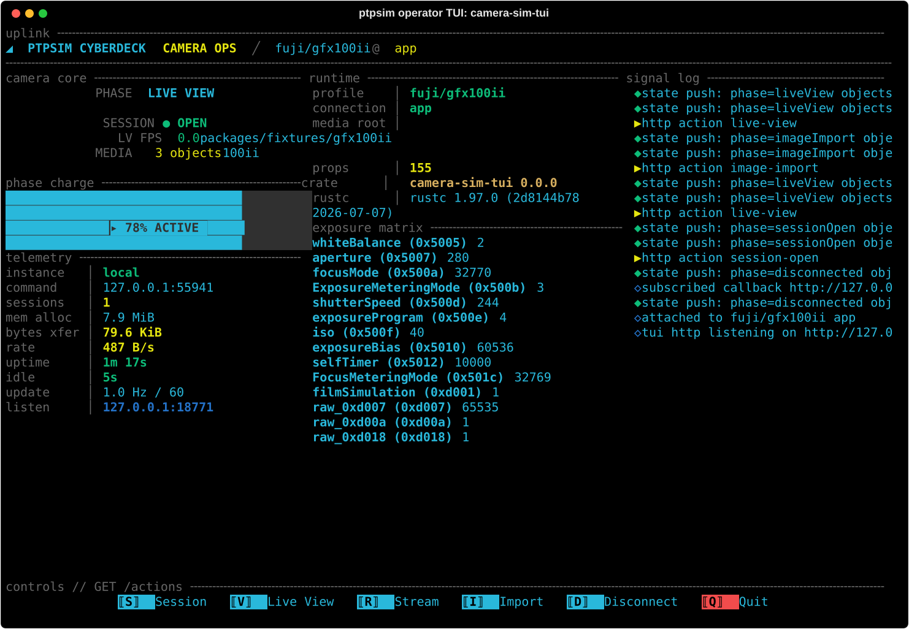

# ptpsim

`ptpsim` is a scriptable, open-source **camera-protocol simulator** and behavior
description engine. It loads camera behavior from manifest data. The engine
has no per-manufacturer code.

Any camera-control app can target any camera ptpsim supports. Manifest (camera
config) updates load at runtime. Full end-to-end scripting is possible for
testing and development.

ptpsim is the camera-behavior driver for https://fujikage.io. Anyone can add
new camera support or fix camera behavior bugs.

[`DESIGN.md`](DESIGN.md) describes the full architecture.
[`docs/CONTAINER.md`](docs/CONTAINER.md) covers the simulator service and its
container image. [`docs/REAL_CAMERA_PTPIP.md`](docs/REAL_CAMERA_PTPIP.md)
covers driving a real camera from the same manifests.

<p>

</p>

The operator TUI on a simulated GFX100 II.

## Using ptpsim

### Develop an app against a simulated camera

`./run` builds and serves a GFX100 II PTP/IP camera on loopback with the
committed manifest and fixtures. It is idempotent: if a healthy instance is
already listening, it prints its address instead of starting a second one.
`PTPSIM_*` environment variables override the profile, ports, and fixtures.

```sh
./run
```

`scripts/run-tui` attaches to the running service (starting `./run` first if
needed) and shows the operator TUI with live camera state.

```sh
scripts/run-tui
```

For tight integration with app development, register a state callback. Start
the service with `--state-callback http://host:port/path` (or
`PTPSIM_STATE_CALLBACK` via `./run`), or register at runtime on the control
endpoint:

```sh
curl -X POST http://127.0.0.1:8080/callbacks \
  -d '{"url":"http://127.0.0.1:8770/state"}'
```

The service then POSTs a JSON snapshot of the full camera state on every
change, debounced (150 ms) and fire-and-forget; it never blocks the PTP
responder path. A dev panel or test harness can host the receiving endpoint.

More: [tools/camera-sim-tui/README.md](tools/camera-sim-tui/README.md) and
[docs/CONTAINER.md](docs/CONTAINER.md).

### Automate the simulator

`camera-simctl` is a CLI over the control HTTP endpoint (default
127.0.0.1:8080). It covers health checks, a sequence-numbered lifecycle trace
with a cursor, shutdown, and occurrence-scoped command-channel fault injection
(list, add, delete, clear) for testing failure handling.

```sh
cargo run -p camera-simctl -- health
cargo run -p camera-simctl -- trace --after 0
cargo run -p camera-simctl -- fault list
```

`--startup-state <file>` on the service applies a YAML/JSON state overlay
(schema `ptpsim-startup-state/v1`) before listeners serve. The fixture at
`packages/fixtures/startup-state/gfx100ii-iso-2000.yaml` is a runnable
example.

For CI, build the container image:

```sh
docker build -t ptpsim:local .
```

The ports contract is in [docs/CONTAINER.md](docs/CONTAINER.md).

### Drive a real camera for protocol work

`camera-initiator` is a headless probe that loads the same manifests and uses
the same shipping codecs and executors an app gets through the FFI. Editing
YAML and rerunning exercises the real protocol program.

```sh
cargo run -p camera-initiator -- \
  --camera CAMERA_IP \
  --manifest packages/camera-config-data/fuji/gfx100ii/gfx100ii.yaml \
  --manufacturer packages/camera-config-data/fuji/fuji.yaml \
  entry --to shooting/stills
```

It supports `entry`, `action`, and `switch` commands, PCSS wireless-tether
discovery, `--then` action chaining, and bounded probe plans. It writes
traces plus `camera-observation/v1` JSONL bundles.

Safety: it sends commands to a real camera. Use a body and media card whose
state may safely change.

More: [docs/REAL_CAMERA_PTPIP.md](docs/REAL_CAMERA_PTPIP.md).

## Layout

```
crates/
  ptp-core              PTP/IP packet codecs, containers, object/property encoders
  camera-config         manifest schema, validation, queries, bundle->proposal generator
  camera-media-store    camera SDcard model, object handles, thumbnails
  camera-sim            generic responder engine + scripting runtime
  protocol-primitives   concern-organized framing/quirk/establishment primitives
  camera-protocol-ffi   optional Swift/Ruby FFI boundary
services/
  camera-sim-service    tokio service: PTP listeners + control HTTP
tools/
  camera-initiator      headless real-camera PTP/IP probe over the shipping engine
  camera-simctl         CLI over the control API
  camera-sim-tui        TUI for local app testing
packages/
  camera-config-data    manifest schema, golden packets, captured camera manifests
  fixtures              small redistributable media fixtures
```

## Build and test

```sh
cargo test            # Rust workspace
```

## License

Dual-licensed under MIT OR Apache-2.0.

## Contributing

To change existing manifest config, I need to see data, namely wire evidence. A
TSV of a pcap is fine. Part of the reason this project exists is because even
manufacturer SDKs don't get this exactly right.

Any code submissions need to have test coverage. All contributions must be under
the same license.
